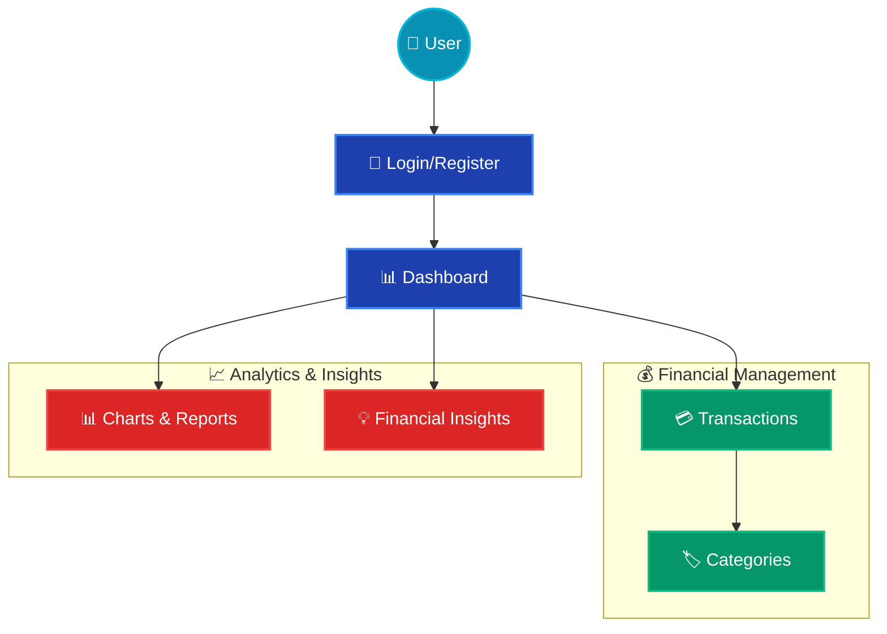

# MyKhata - Personal Finance Management System

## 🎯 Overview

MyKhata is a full-stack personal finance management system designed to provide users with comprehensive tools for tracking income, expenses, and financial insights. The application offers an intuitive interface with advanced analytics, real-time data visualization, and secure user authentication.

### Key Highlights

- **Real-time Financial Tracking**: Monitor income and expenses with instant updates
- **Advanced Analytics**: Comprehensive insights and spending pattern analysis
- **Multi-currency Support**: Handle transactions in multiple currencies
- **Responsive Design**: Optimized for desktop, tablet, and mobile devices
- **Secure Authentication**: JWT-based authentication with encrypted data storage

## ✨ Features

### 🔐 Authentication & Security
- **User Registration & Login**: Secure account creation and authentication
- **JWT Token Management**: Stateless authentication with automatic token refresh
- **Password Encryption**: Bcrypt hashing for secure password storage
- **Protected Routes**: Role-based access control for application sections

### 💰 Transaction Management
- **CRUD Operations**: Create, read, update, and delete financial transactions
- **Multi-category Support**: Organize transactions with customizable categories
- **Date Range Filtering**: Filter transactions by custom date ranges
- **Advanced Search**: Search transactions by description, category, or amount
- **Bulk Operations**: Efficient management of multiple transactions

### 📊 Data Visualization & Analytics
- **Interactive Charts**: Dynamic doughnut and bar charts using Chart.js
- **Real-time Insights**: Automated financial insights and spending trends
- **Category Breakdown**: Visual representation of expense distribution
- **Income vs Expense Analysis**: Comparative financial performance metrics
- **Responsive Charts**: Optimized visualization for all screen sizes

### 🎨 User Experience
- **Dark/Light Theme**: Toggle between themes for personalized experience
- **Responsive Design**: Mobile-first approach with Tailwind CSS
- **Smooth Animations**: Framer Motion powered transitions and interactions
- **Toast Notifications**: Real-time feedback for user actions
- **Loading States**: Optimistic UI with skeleton loading components

### 🔍 Advanced Features
- **Currency Conversion**: Multi-currency transaction support
- **Export Capabilities**: Download transaction data in various formats
- **Data Persistence**: Automatic data saving and synchronization
- **Error Handling**: Comprehensive error boundaries and fallback UI
- **Performance Optimization**: Code splitting and lazy loading

## 🏗️ System Architecture

## 🙏 Acknowledgments

- [React](https://reactjs.org/) for the amazing frontend framework
- [Tailwind CSS](https://tailwindcss.com/) for the utility-first CSS framework
- [Chart.js](https://www.chartjs.org/) for data visualization
- [MongoDB Atlas](https://www.mongodb.com/atlas) for cloud database hosting

---

**Built with ❤️ by Dhyan Patel**
